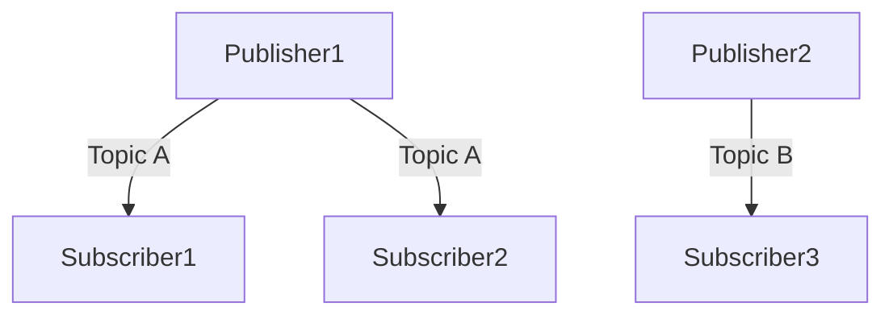

# ROS 2 Middleware

This chapter introduces the core concepts of ROS 2 middleware, focusing on how different components of a robotics system communicate with each other. We will cover the data-centric publish/subscribe model, quality of service (QoS) settings, and the role of DDS (Data Distribution Service) as the underlying communication protocol.

## Introduction to ROS 2 Communication

ROS 2 (Robot Operating System 2) is designed to build robust and scalable robotics applications. A fundamental aspect of ROS 2 is its communication infrastructure, which allows various processes (nodes) to exchange information efficiently. Unlike ROS 1's custom TCP/IP-based communication, ROS 2 leverages an industry standard called DDS (Data Distribution Service) for its middleware.

### The Publish/Subscribe Model

The primary communication pattern in ROS 2 is the **publish/subscribe** model. In this model:

*   **Publishers** are nodes that send data (messages) on a specific named channel (topic).
*   **Subscribers** are nodes that receive data from a specific named channel (topic).

This decoupling of publishers and subscribers means they don't need to know about each other's existence. They only need to agree on the topic name and the message type being exchanged.

### Key Advantages:

*   **Decoupling**: Publishers and subscribers operate independently, improving modularity.
*   **Scalability**: Easily add more publishers or subscribers without modifying existing code.
*   **Flexibility**: Different parts of the system can run on different machines or even different networks.

## Data Distribution Service (DDS)

DDS is an international standard (OMG DDS) that provides a robust, high-performance, and scalable data-sharing middleware. ROS 2 uses various DDS implementations (e.g., Fast DDS, RTI Connext, Cyclone DDS) as its "RMW" (ROS Middleware Wrapper).

### Key Features of DDS:

*   **Discovery**: DDS participants automatically discover each other and available topics.
*   **Quality of Service (QoS)**: Fine-grained control over communication reliability, durability, latency, and more.
*   **Reliability**: Ensures messages are delivered even in unreliable network conditions.
*   **Durability**: Allows subscribers to receive historical data even if they join after a publisher started.
*   **Real-time Capabilities**: Optimized for low-latency, high-throughput data exchange crucial for robotics.

## Quality of Service (QoS) Policies

QoS policies are crucial in ROS 2 for defining the behavior of publishers and subscribers. They govern how data is delivered, stored, and managed. Common QoS policies include:

*   **History**:
    *   `KEEP_LAST`: Keep only the N most recent samples.
    *   `KEEP_ALL`: Keep all samples (up to resource limits).
*   **Depth**: Used with `KEEP_LAST` history to specify the number of samples to keep.
*   **Reliability**:
    *   `BEST_EFFORT`: Messages may be lost (fastest, lowest overhead).
    *   `RELIABLE`: Guarantees delivery, retries lost messages (slower, higher overhead).
*   **Durability**:
    *   `VOLATILE`: Data is not persistent; only new subscribers receive messages.
    *   `TRANSIENT_LOCAL`: Publishers retain data for new subscribers.
*   **Liveliness**: How the system detects if a publisher or subscriber is still active.
*   **Lease Duration**: Used with Liveliness to specify how long to wait before declaring a participant not alive.

### Example Scenario: Choosing QoS

Consider a sensor publishing high-frequency, non-critical data (e.g., lidar scans) and a command interface publishing critical commands (e.g., motor controls).

*   **Lidar Publisher/Subscriber**:
    *   `History: KEEP_LAST, Depth: 1` (only care about the latest scan)
    *   `Reliability: BEST_EFFORT` (can tolerate occasional loss for speed)
    *   `Durability: VOLATILE` (no need for old scans)

*   **Command Publisher/Subscriber**:
    *   `History: KEEP_LAST, Depth: 1` (only care about the latest command)
    *   `Reliability: RELIABLE` (commands must not be lost)
    *   `Durability: VOLATILE` (no need for old commands, as they are time-sensitive)

## RMW (ROS Middleware Wrapper)

The RMW layer in ROS 2 provides an abstraction over different DDS implementations. This allows developers to write ROS 2 applications that can run on various DDS vendors (Fast DDS, RTI Connext, Cyclone DDS) without changing their code.

### Interoperability

One of the significant advantages of DDS, and consequently ROS 2, is its **interoperability**. Different DDS implementations can communicate with each other, meaning a Fast DDS publisher can communicate with an RTI Connext subscriber, and vice-versa. This is crucial for complex systems where different components might use different DDS vendors.

## Conclusion

Understanding ROS 2 middleware, especially the publish/subscribe model, DDS, and QoS policies, is foundational for building effective robotics systems. By carefully selecting QoS settings, you can optimize communication for reliability, performance, and resource usage, tailoring it to the specific needs of your robotic application.

In the next chapter, we will delve deeper into the core building blocks of ROS 2: nodes, topics, and services, and learn how to implement them in practice.
