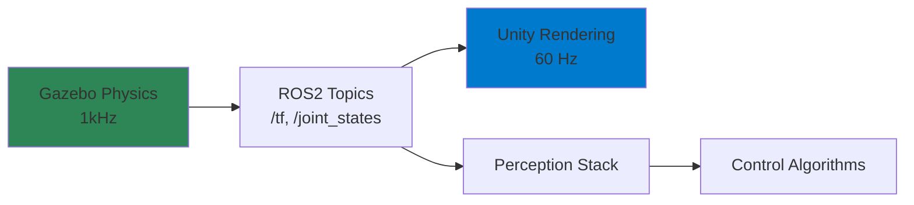

# Content Structure Guidelines

**Purpose**: Define chapter organization, content ratios, and quality standards for Module 2 documentation

**Created**: 2025-12-06
**Module**: Module 2 - The Digital Twin

---

## Chapter Length Targets

| Content Type | Lines (MDX) | Words (Prose) | Sections |
|--------------|-------------|---------------|----------|
| Module Intro | 100-150 | 300-500 | 3-4 |
| Full Chapter | 400-600 | 1500-2500 | 5-7 |
| Major Section (h2) | 80-150 | 300-600 | 2-4 subsections |
| Subsection (h3) | 30-60 | 100-250 | - |

**Constraints**:
- **Minimum**: 300 lines (insufficient depth for learning)
- **Maximum**: 800 lines (split into sub-chapters if exceeded)
- **Ideal**: 450-550 lines (optimal reading length, ~20 minutes)

---

## Section Hierarchy Rules

### Heading Levels

```markdown
# Chapter Title                    ← h1 (ONE per file, matches frontmatter title)
## Major Section                   ← h2 (3-5 per chapter)
### Subsection                     ← h3 (2-4 per h2)
#### Rare Detail                   ← h4 (only for complex topics)
```

### Hierarchy Guidelines

1. **Never skip heading levels**: No jumping from h2 to h4
2. **h1 appears once**: Only the chapter title at the top
3. **h2 for major concepts**: Each should be independently valuable
4. **h3 for subtopics**: Elaborate on h2 content
5. **h4 sparingly**: Only when absolutely necessary for complex details

### Example Hierarchy

```markdown
# Chapter 1 - Simulating Physics in Gazebo           ← h1

## Gazebo Architecture                               ← h2
### Client-Server Model                              ← h3
### Physics Engine Integration                       ← h3

## URDF Robot Models                                 ← h2
### Links and Joints                                 ← h3
### Inertial Properties                              ← h3
#### Computing Inertia Tensors                       ← h4 (advanced detail)
```

---

## Content Ratios (by Line Count)

Ideal distribution for a 500-line chapter:

| Content Type | Lines | Percentage | Purpose |
|--------------|-------|------------|---------|
| Prose (explanations) | 225 | 45% | Concepts, theory, "why" before "how" |
| Code examples | 150 | 30% | Practical demonstrations, runnable snippets |
| Diagrams/callouts | 75 | 15% | Visual aids, warnings, key takeaways |
| Lists/tables | 50 | 10% | Structured information, comparisons |

**Validation**:
- If prose < 40%: Content may be too terse, add explanations
- If code > 35%: Too many examples, consolidate or explain less
- If diagrams < 10%: Missing visual aids, add Mermaid diagrams
- If lists > 15%: Too fragmented, convert to prose

---

## Required Elements Per Chapter

Every chapter MUST include:

- [ ] **1 Learning Objectives callout** (top of chapter, after h1)
- [ ] **3-5 Code examples** with explanations (distributed across sections)
- [ ] **2-3 Diagrams** (Mermaid or images, at least 1 architecture diagram)
- [ ] **1-2 Warning callouts** (common pitfalls, errors to avoid)
- [ ] **1 Summary callout** (end of chapter, "Checkpoint" or "Key Takeaways")
- [ ] **3-5 External links** (official docs, papers, tutorials in "Further Reading")

### Optional Elements (Add Value)

- [ ] **Video embed** (1 max, for complex visual demonstrations)
- [ ] **Tabs** (for multi-language code or alternative approaches)
- [ ] **Tables** (comparison matrices, parameter references)
- [ ] **Quiz component** (5-10 questions for self-assessment)

---

## Universal Chapter Template

All chapters should follow this structure:

```markdown
---
[Frontmatter with metadata]
---

import [Components from contracts/component-apis.md]

# Chapter Title

<Callout type="info" title="Learning Objectives">
By the end of this chapter, you will be able to:
- [Specific, measurable learning goal using Bloom's taxonomy verbs]
- [Another goal]
- [Another goal]
</Callout>

## Introduction (5-10% of chapter)

[Context: Why is this topic important?]
[Motivation: What problem does it solve?]
[Preview: What will be covered?]

## Conceptual Overview (20-25% of chapter)

[Theory and principles - "why" before "how"]
[Mermaid diagrams for architecture, data flow]
[Key concepts explained before implementation]

### Subsection 1
[Detailed explanation of concept]

### Subsection 2
[Related concept or component]

## Hands-On Tutorial (40-50% of chapter)

[Step-by-step practical implementation]
[CodeBlock components with annotations]
[Worked examples with detailed explanations]

### Step 1: [Action]
[Explanation]
<CodeBlock language="xml" title="filename.ext">
[Code with inline comments]
</CodeBlock>

### Step 2: [Next Action]
[Explanation and expected outcomes]

<Callout type="warning" title="Common Pitfall">
[Typical error and how to avoid it]
</Callout>

## Advanced Topics (10-15% of chapter)

[Optional deep dives for interested learners]

<Tabs groupId="approach">
<TabItem value="basic" label="Basic Approach" default>
[Simpler method for beginners]
</TabItem>
<TabItem value="advanced" label="Advanced Approach">
[Optimized or alternative method]
</TabItem>
</Tabs>

## Common Issues (5-10% of chapter)

<Callout type="warning" title="Troubleshooting">
**Problem**: [Typical error message or symptom]
**Cause**: [Why it happens]
**Solution**: [Step-by-step fix]

**Problem**: [Another common issue]
...
</Callout>

## Summary (5% of chapter)

<Callout type="success">
**Key Takeaways**:
- [Main learning point]
- [Important concept to remember]
- [Practical skill gained]

**Next Steps**: Proceed to [Chapter N+1] to learn [next topic].
</Callout>

## Further Reading

- [Official Documentation](URL) - [Brief description]
- [Tutorial or Paper](URL) - [Why it's useful]
- [Community Resource](URL) - [Additional context]

## Assessment (Optional)

<Quiz>
  <Question>
    [Question text]
    <Answer correct>[Correct answer]</Answer>
    <Answer>[Incorrect option]</Answer>
  </Question>
  <Explanation>
    [Why the correct answer is right]
  </Explanation>
</Quiz>
```

---

## Code Example Standards

### Principles

1. **Minimal**: Show only relevant code, omit boilerplate
2. **Runnable**: Provide complete context (imports, setup) when needed
3. **Explained**: Annotate with comments explaining "why", not "what"
4. **Syntax-Highlighted**: Always use CodeBlock component with correct language
5. **Tested**: All code must be validated before publication

### Code Comment Style

```python
# ✅ GOOD: Explains WHY
samples = 720  # 0.5 degree angular resolution for precise mapping

# ❌ BAD: Repeats WHAT (obvious from code)
samples = 720  # Set samples to 720
```

### Code Block Conventions

```mdx
Before showing code, explain what it does in prose:

We'll configure a LiDAR sensor with 720 samples (0.5° resolution) and 10 Hz update rate:

<CodeBlock language="xml" title="robot.urdf.xacro" highlightLines="12-14">
<gazebo reference="base_link">
  <sensor name="lidar" type="ray">
    <pose>0 0 0.1 0 0 0</pose>
    <ray>
      <scan>
        <horizontal>
          <samples>720</samples>       <!-- 0.5 degree resolution -->
          <resolution>1</resolution>
          <min_angle>-3.14159</min_angle>
          <max_angle>3.14159</max_angle>
        </horizontal>
      </scan>
      <range>
        <min>0.1</min>
        <max>30.0</max>               <!-- 30 meter maximum range -->
      </range>
    </ray>
    <update_rate>10</update_rate>     <!-- 10 Hz scan frequency -->
  </sensor>
</gazebo>
</CodeBlock>

After code, explain key parameters:

**Key Configuration**:
- `samples`: Angular resolution (higher = more points, slower performance)
- `max`: Range limit (longer = more processing, noisier data)
- `update_rate`: Scan frequency (higher = more data, heavier CPU load)
```

---

## Diagram Standards

### When to Use Each Diagram Type

| Diagram Type | Use Case | Tool |
|--------------|----------|------|
| Flowchart | Process workflows, decision trees | Mermaid `graph TD` |
| Sequence | Message passing, ROS interactions | Mermaid `sequenceDiagram` |
| Component | System architecture, data flow | Mermaid `graph LR` |
| State Machine | FSMs, robot controller states | Mermaid `stateDiagram-v2` |
| Screenshot | GUI tutorials, configuration steps | PNG |
| Rendered 3D | Robot visualizations | PNG/JPG |
| Technical Drawing | URDF structure, coordinate frames | SVG |
| Chart/Graph | Performance data, benchmarks | PNG with chart library |

### Mermaid Diagram Guidelines

**Color Palette** (use sparingly for emphasis):
```
- Primary: #2e8555 (Docusaurus green)
- Secondary: #007ACC (blue)
- Warning: #FFA500 (orange)
- Danger: #DC3545 (red)
- Success: #28A745 (green)
```

**Example - System Architecture**:


---

## Link Conventions

### Internal Links (within docs)

```mdx
[Chapter 2 - Sensor Simulation](./chapter-2-sensor-simulation)
[Module 1 Introduction](../module-1-robotic-nervous-system/index)
[Back to Module Index](./index)
```

### External Links

```mdx
[Gazebo Classic Documentation](http://classic.gazebosim.org/tutorials)
[ROS2 Humble Docs](https://docs.ros.org/en/humble/)
[Unity Robotics Hub GitHub](https://github.com/Unity-Technologies/Unity-Robotics-Hub)
```

### Link Text Best Practices

✅ **GOOD**: "See the [Gazebo URDF tutorial](URL) for details on joint definitions"
❌ **BAD**: "Click [here](URL)" (not accessible, not descriptive)

✅ **GOOD**: "Learn more in the [official ROS2 documentation](URL)"
❌ **BAD**: "More info: [URL](URL)" (link text should be descriptive, not the URL)

---

## Voice and Tone Guidelines

### Voice Characteristics

- **Professional**: Technical accuracy, precise terminology
- **Encouraging**: "You'll be able to...", "Let's configure..."
- **Active**: "Configure the sensor" vs "The sensor should be configured"
- **Direct**: Address reader as "you", use second person
- **Clear**: Avoid jargon without explanation, define acronyms on first use

### Tone Examples

✅ **GOOD**:
> "Gazebo uses the ODE physics engine by default, which provides stable simulation for articulated robots like humanoids. While Bullet offers faster collision detection, ODE's reliability makes it the better choice for complex joint systems."

❌ **BAD** (too casual):
> "So basically, Gazebo is like, really good at physics stuff. ODE is the best, trust me!"

❌ **BAD** (too formal):
> "The Gazebo simulation environment utilizes the Open Dynamics Engine (ODE) as its default physics computation backend, a selection predicated upon empirical observations regarding stability characteristics in multi-articulated robotic systems."

---

## Quality Assurance Checklist

Before publishing a chapter, verify:

**Technical Accuracy**:
- [ ] All code examples tested and functional
- [ ] External links valid (no 404s)
- [ ] Version numbers correct (Gazebo, ROS2, Unity)
- [ ] Commands work on target platform (Linux, macOS, Windows)
- [ ] Technical claims verified against official documentation

**Accessibility**:
- [ ] Alt text for all images (descriptive, not "image of...")
- [ ] Heading hierarchy correct (no skipped levels)
- [ ] Color contrast ≥ 4.5:1 for body text (WCAG AA)
- [ ] Keyboard navigation works for all interactive elements
- [ ] Screen reader compatible (semantic HTML, ARIA labels)

**Performance**:
- [ ] Images optimized (< 500KB each, compressed)
- [ ] Videos use external hosting (YouTube) or compressed (< 5MB)
- [ ] Lighthouse score > 90 for the chapter page
- [ ] MDX compiles in < 5 seconds
- [ ] No layout shift (CLS < 0.1)

**SEO**:
- [ ] Frontmatter complete (title, description, tags)
- [ ] Description 50-160 characters
- [ ] Open Graph image provided (1200x630px)
- [ ] Internal links use relative paths
- [ ] Keyword density appropriate (1-2% for primary keywords)

**Style**:
- [ ] Voice consistent (professional, encouraging)
- [ ] No jargon without explanation
- [ ] Active voice preferred (> 80% of sentences)
- [ ] Spell check and grammar review passed
- [ ] Code comments explain "why", not "what"

---

## Content Maintenance

### Version Control

- Commit each chapter as a separate commit
- Use semantic commit messages: `docs(module-2): add chapter 1 physics simulation`
- Tag major revisions: `v1.0.0`, `v1.1.0`

### Update Frequency

- **Quarterly**: Review external links, update deprecated content
- **On Software Release**: Update version numbers, commands, screenshots
- **On User Feedback**: Address confusion, add missing explanations

### Deprecation Policy

When content becomes outdated:
1. Add banner at top: "⚠️ This content covers Gazebo Classic. For Gazebo Garden, see [new version](URL)"
2. Keep old content for 6 months (versioning support)
3. Archive or remove after transition period

---

**Content Structure Status**: ✅ **COMPLETE**

All guidelines defined. Ready for content authoring in Phase 3+ (User Stories).
